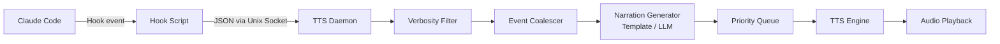

# Claude Narrator

**English** | [中文](docs/README.zh.md) | [日本語](docs/README.ja.md)

> TTS audio narration for Claude Code — hear what Claude is doing without watching the terminal.

Claude Narrator uses Claude Code's hooks system to speak work status in real-time. File reads, edits, command execution, task completion, permission prompts — all narrated by voice.

## Quick Start

### Option 1: pip install

```bash
pip install claude-narrator
claude-narrator install
claude-narrator start
```

### Option 2: Claude Code Plugin

```
/plugin install claude-narrator
/claude-narrator:setup
```

## Test

```bash
claude-narrator test "Hello, Claude Narrator is ready"
```

## Commands

```bash
claude-narrator start [-f|--foreground] [--web]  # Start daemon (foreground / with web UI)
claude-narrator stop                              # Stop daemon
claude-narrator restart [-f|--foreground]          # Restart daemon
claude-narrator reload                            # Hot-reload config (no restart)
claude-narrator status                            # Show daemon status
claude-narrator test "text"                       # Test TTS output
claude-narrator install                           # Install hooks into Claude Code
claude-narrator uninstall                         # Remove hooks
claude-narrator config get <key>                  # Get config value (e.g. general.verbosity)
claude-narrator config set <key> <value>          # Set config value
claude-narrator config reset                      # Reset to defaults
claude-narrator cache clear                       # Clear audio cache
```

## How It Works



- **Hook Script**: Lightweight forwarder — outputs `{"async": true}` so Claude Code continues immediately, then forwards stdin JSON to daemon in background. Zero blocking.
- **Daemon**: asyncio-based background process handling all logic.
- **Tool Registry**: 42 tools registered with display names, categories, and response parsers for enriched narration.
- **Event Coalescer**: Merges rapid consecutive events (e.g., 5 Read calls → "5 Read operations"). 0.5s window.
- **Priority Queue**: HIGH (errors, notifications) interrupts current playback; LOW (tool calls) dropped when queue is full.
- **Audio Cache**: LRU file-based cache integrated into TTS path — repeated phrases skip network requests.

## Configuration

Config file: `~/.claude-narrator/config.json`

```json
{
  "general": {
    "verbosity": "normal",
    "language": "en",
    "enabled": true
  },
  "tts": {
    "engine": "edge-tts",
    "voice": "en-US-AriaNeural",
    "openai": {
      "api_key_env": "OPENAI_API_KEY",
      "model": "tts-1",
      "voice": "nova"
    }
  },
  "narration": {
    "mode": "template",
    "max_queue_size": 5,
    "max_narration_seconds": 15,
    "skip_rapid_events": true,
    "llm": {
      "provider": "ollama",
      "model": "qwen2.5:3b"
    }
  },
  "cache": {
    "enabled": true,
    "max_size_mb": 50
  },
  "filters": {
    "ignore_tools": [],
    "ignore_paths": [],
    "only_tools": null,
    "custom_rules": []
  },
  "web": {
    "enabled": false,
    "host": "127.0.0.1",
    "port": 19822
  }
}
```

### Verbosity Levels

| Level | What gets narrated |
|-------|-------------------|
| `minimal` | Task completion, errors, permission prompts/denials, stop failures |
| `normal` (default) | Above + file operations, subagent activity, session start/end, context compaction, task lifecycle |
| `verbose` | Everything (including worktree operations, directory changes, file watch events) |

### Supported Hook Events (20 of 27)

| Event | Verbosity | Description |
|-------|-----------|-------------|
| `PreToolUse` | normal (file ops) | Before tool execution (40+ tools with display names via Tool Registry) |
| `PostToolUse` | normal (file ops) | After tool completion (with result summaries for Bash/Grep/Glob/Read/WebSearch) |
| `PostToolUseFailure` | minimal | Tool execution failed |
| `Stop` | minimal | Agent completed response |
| `StopFailure` | minimal | Agent failed to complete |
| `Notification` | minimal | User attention needed (7 notification types: idle, permission, computer use, auth, etc.) |
| `PermissionRequest` | minimal | Permission prompt waiting |
| `PermissionDenied` | minimal | Tool permission blocked |
| `SubagentStart` | normal | Subagent launched |
| `SubagentStop` | normal | Subagent completed |
| `SessionStart` | normal | Session begins (with source variant) |
| `SessionEnd` | normal | Session ended |
| `PreCompact` | verbose | Context compression starting |
| `PostCompact` | normal | Context compression completed |
| `TaskCreated` | normal | Team task delegated |
| `TaskCompleted` | normal | Team task finished |
| `WorktreeCreate` | verbose | Git worktree created |
| `WorktreeRemove` | verbose | Git worktree removed |
| `CwdChanged` | verbose | Working directory changed |
| `FileChanged` | verbose | Watched file modified |

### TTS Engines

| Engine | Platform | Notes |
|--------|----------|-------|
| `edge-tts` (default) | All | Free, high quality, requires internet |
| `say` | macOS | System built-in, zero dependencies |
| `espeak` | Linux | Offline, install via package manager |
| `openai` | All | Best quality, requires API key |

### Languages

| Language | Code | Default Voice |
|----------|------|---------------|
| English | `en` | en-US-AriaNeural |
| Chinese | `zh` | zh-CN-XiaoxiaoNeural |
| Japanese | `ja` | ja-JP-NanamiNeural |

### Personality

Set the narration style:

```bash
claude-narrator config set narration.personality tengu
claude-narrator reload
```

| Personality | Style | Example |
|-------------|-------|---------|
| `concise` (default) | Short, direct | "Reading app.py" |
| `tengu` | Whimsical + spinner prefix | "Cogitating... diving into app.py" |
| `professional` | Formal, detailed | "Now reading source file app.py" |
| `casual` | Conversational | "Checking out app.py" |

Combine multiple personalities (layered composition):

```bash
claude-narrator config set narration.personality '["tengu", "professional"]'
```

Enable auto-update of Tengu spinner words from GitHub:

```bash
claude-narrator config set narration.tengu_prefix_auto_update true
```

### Narration Modes

- **Template** (default): Fast, deterministic. Uses i18n JSON templates to generate short phrases like "Reading src/app.py".
- **LLM**: Natural language narration via Ollama (local), OpenAI, or Anthropic. Falls back to template on timeout (3s).

```bash
claude-narrator config set narration.mode llm
claude-narrator config set narration.llm.provider ollama
claude-narrator config set narration.llm.model qwen2.5:3b
claude-narrator reload  # Apply without restart
```

### Custom Filters

Filter events by tool, file path, or custom rules:

```bash
# Ignore all Read events
claude-narrator config set filters.ignore_tools '["Read"]'

# Only narrate specific tools
claude-narrator config set filters.only_tools '["Write", "Edit", "Bash"]'
```

Config example with custom rules:

```json
{
  "filters": {
    "ignore_paths": ["node_modules/*", "*.lock"],
    "custom_rules": [
      {
        "match": { "tool": "Bash", "input_contains": "npm test" },
        "action": "skip"
      }
    ]
  }
}
```

### Sound Effects

Play short audio cues alongside (or instead of) TTS:

```json
{
  "sounds": {
    "enabled": true,
    "directory": "~/.claude-narrator/sounds",
    "events": {
      "Stop": "complete.wav",
      "Notification": "alert.wav",
      "PostToolUseFailure": "error.wav"
    }
  }
}
```

### Web UI

Real-time dashboard showing daemon status and event stream:

```bash
claude-narrator config set web.enabled true
claude-narrator restart
# Open http://127.0.0.1:19822
```

### Context Monitor

Optional voice announcements when token usage reaches thresholds:

```bash
claude-narrator config set context_monitor.enabled true
claude-narrator config set context_monitor.thresholds '[50, 70, 85, 95]'
claude-narrator reload
```

> **Warning**: This feature uses Claude Code's statusline slot. If you use claude-hud or another statusline plugin, they will conflict. Only one statusline can be active at a time.

## Requirements

- Python 3.10+
- Claude Code v1.0.80+

## License

[Apache-2.0](LICENSE)

## Star History

<a href="https://www.star-history.com/?repos=XKHoshizora%2Fclaude-narrator&type=date&legend=bottom-right">
 <picture>
   <source media="(prefers-color-scheme: dark)" srcset="https://api.star-history.com/chart?repos=XKHoshizora/claude-narrator&type=date&theme=dark&legend=top-left" />
   <source media="(prefers-color-scheme: light)" srcset="https://api.star-history.com/chart?repos=XKHoshizora/claude-narrator&type=date&legend=top-left" />
   
 </picture>
</a>
