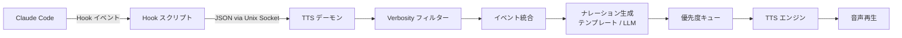

# Claude Narrator

[English](../README.md) | [中文](README.zh.md) | **日本語**

> Claude Code の TTS 音声ナレーションプラグイン — ターミナルを見なくても AI の作業状況がわかる。

Claude Narrator は Claude Code の Hooks システムを利用して、作業状況をリアルタイムに音声で伝えます。ファイルの読み書き、コマンド実行、タスク完了、権限確認 — すべて音声でお知らせします。

## クイックスタート

### 方法 1：pip インストール

```bash
pip install claude-narrator
claude-narrator install
claude-narrator start
```

### 方法 2：Claude Code プラグイン

```
/plugin install claude-narrator
/claude-narrator:setup
```

## テスト

```bash
claude-narrator test "こんにちは、Claude Narrator の準備ができました"
```

## コマンド一覧

```bash
claude-narrator start [-f|--foreground] [--web]  # デーモン起動（フォアグラウンド / Web UI 付き）
claude-narrator stop                              # デーモン停止
claude-narrator restart [-f|--foreground]          # デーモン再起動
claude-narrator reload                            # 設定のホットリロード（再起動なし）
claude-narrator status                            # デーモン状態表示
claude-narrator test "テキスト"                   # TTS テスト
claude-narrator install                           # Claude Code に hooks をインストール
claude-narrator uninstall                         # hooks を削除
claude-narrator config get <キー>                 # 設定値を取得
claude-narrator config set <キー> <値>            # 設定値を変更
claude-narrator config reset                      # デフォルトに戻す
claude-narrator cache clear                       # 音声キャッシュをクリア
```

## 仕組み



- **Hook スクリプト**：`{"async": true}` を出力してClaude Codeを即座に解放し、バックグラウンドでデーモンにイベントを転送。ゼロブロッキング。
- **デーモン**：asyncio ベースのバックグラウンドプロセス。全ロジックを処理。
- **ツールレジストリ**：42個のツールに表示名、カテゴリ、レスポンスパーサーを登録し、差別化されたナレーションを提供。
- **イベント統合**：0.5秒以内の同一ツールの連続呼び出しを1つにまとめます（例：5回のRead → "5 Read operations"）。
- **優先度キュー**：高優先度（エラー、通知）は現在の再生を中断。低優先度（ツール呼び出し）はキュー満杯時に破棄。
- **オーディオキャッシュ**：LRUファイルキャッシュをTTSパスに統合 — 繰り返しフレーズはネットワークリクエストをスキップ。

## 設定

設定ファイル：`~/.claude-narrator/config.json`

```json
{
  "general": {
    "verbosity": "normal",
    "language": "ja",
    "enabled": true
  },
  "tts": {
    "engine": "edge-tts",
    "voice": "ja-JP-NanamiNeural",
    "openai": {
      "api_key_env": "OPENAI_API_KEY",
      "model": "tts-1",
      "voice": "nova"
    }
  },
  "narration": {
    "mode": "template",
    "max_queue_size": 5,
    "max_narration_seconds": 15,
    "skip_rapid_events": true,
    "llm": {
      "provider": "ollama",
      "model": "qwen2.5:3b"
    }
  },
  "cache": {
    "enabled": true,
    "max_size_mb": 50
  },
  "filters": {
    "ignore_tools": [],
    "ignore_paths": [],
    "only_tools": null,
    "custom_rules": []
  },
  "web": {
    "enabled": false,
    "host": "127.0.0.1",
    "port": 19822
  }
}
```

### Verbosity レベル

| レベル | ナレーション対象 |
|--------|-----------------|
| `minimal` | タスク完了、エラー、権限要求/拒否、停止失敗 |
| `normal`（デフォルト） | 上記 + ファイル操作、サブタスク、セッション開始/終了、コンテキスト圧縮、タスクライフサイクル |
| `verbose` | すべてのイベント（ワークツリー操作、ディレクトリ変更、ファイル監視含む） |

### サポートされるHookイベント（20/27）

| イベント | レベル | 説明 |
|----------|--------|------|
| `PreToolUse` | normal（ファイル操作） | ツール実行前（Tool Registryにより40+ツールの差別化ナレーション） |
| `PostToolUse` | normal（ファイル操作） | ツール完了後（Bash/Grep/Glob/Read/WebSearchは結果サマリー付き） |
| `PostToolUseFailure` | minimal | ツール実行失敗 |
| `Stop` | minimal | タスク完了 |
| `StopFailure` | minimal | タスク実行失敗 |
| `Notification` | minimal | ユーザーの注意が必要（7種の通知タイプ：入力待ち、権限確認、コンピュータ操作モード等） |
| `PermissionRequest` | minimal | 権限要求待ち |
| `PermissionDenied` | minimal | 権限拒否 |
| `SubagentStart` | normal | サブエージェント開始 |
| `SubagentStop` | normal | サブエージェント完了 |
| `SessionStart` | normal | セッション開始（startup/resume/clear/compact区分） |
| `SessionEnd` | normal | セッション終了 |
| `PreCompact` | verbose | コンテキスト圧縮開始 |
| `PostCompact` | normal | コンテキスト圧縮完了 |
| `TaskCreated` | normal | チームタスク作成 |
| `TaskCompleted` | normal | チームタスク完了 |
| `WorktreeCreate` | verbose | Gitワークツリー作成 |
| `WorktreeRemove` | verbose | Gitワークツリー削除 |
| `CwdChanged` | verbose | 作業ディレクトリ変更 |
| `FileChanged` | verbose | ファイル変更検出 |

### TTS エンジン

| エンジン | プラットフォーム | 備考 |
|----------|-----------------|------|
| `edge-tts`（デフォルト） | 全プラットフォーム | 無料、高品質、インターネット必要 |
| `say` | macOS | システム内蔵、依存なし |
| `espeak` | Linux | オフライン対応 |
| `openai` | 全プラットフォーム | 最高品質、API キー必要 |

### 対応言語

| 言語 | コード | デフォルト音声 |
|------|--------|---------------|
| English | `en` | en-US-AriaNeural |
| 中文 | `zh` | zh-CN-XiaoxiaoNeural |
| 日本語 | `ja` | ja-JP-NanamiNeural |

### ナレーション性格 (Personality)

ナレーションスタイルを設定：

```bash
claude-narrator config set narration.personality tengu
claude-narrator reload
```

| 性格 | スタイル | 例 |
|------|---------|-----|
| `concise`（デフォルト） | 簡潔 | "app.py を読み込み中" |
| `tengu` | 遊び心 + spinner | "Cogitating... app.py に潜入" |
| `professional` | フォーマル | "ソースファイル app.py を読み取り中" |
| `casual` | カジュアル | "app.py を見てみる" |

### ナレーションモード

- **テンプレートモード**（デフォルト）：高速で決定的。i18n JSON テンプレートから「src/app.py を読み込み中」のような短文を生成。
- **LLM モード**：Ollama（ローカル）、OpenAI、または Anthropic で自然言語ナレーションを生成。3 秒超過でテンプレートにフォールバック。

```bash
claude-narrator config set narration.mode llm
claude-narrator config set narration.llm.provider ollama
claude-narrator config set narration.llm.model qwen2.5:3b
claude-narrator reload  # 再起動なしで反映
```

### カスタムフィルター

ツール名、ファイルパス、カスタムルールでイベントをフィルタリング：

```json
{
  "filters": {
    "ignore_tools": ["Read"],
    "ignore_paths": ["node_modules/*", "*.lock"],
    "custom_rules": [
      {
        "match": { "tool": "Bash", "input_contains": "npm test" },
        "action": "skip"
      }
    ]
  }
}
```

### サウンドエフェクト

TTS に加えて（または代わりに）短い効果音を再生：

```json
{
  "sounds": {
    "enabled": true,
    "directory": "~/.claude-narrator/sounds",
    "events": {
      "Stop": "complete.wav",
      "Notification": "alert.wav",
      "PostToolUseFailure": "error.wav"
    }
  }
}
```

### Web UI

デーモンのステータスとイベントストリームを表示するリアルタイムダッシュボード：

```bash
claude-narrator config set web.enabled true
claude-narrator restart
# http://127.0.0.1:19822 を開く
```

### コンテキストモニター

トークン使用率が閾値に達した時に音声でお知らせ：

```bash
claude-narrator config set context_monitor.enabled true
claude-narrator reload
```

> **警告**：この機能は Claude Code の statusline スロットを使用します。claude-hud などの statusline プラグインと競合します。

## 動作要件

- Python 3.10+
- Claude Code v1.0.80+

## ライセンス

MIT
