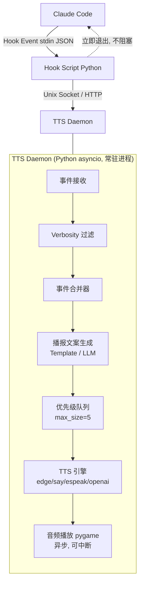
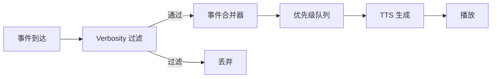
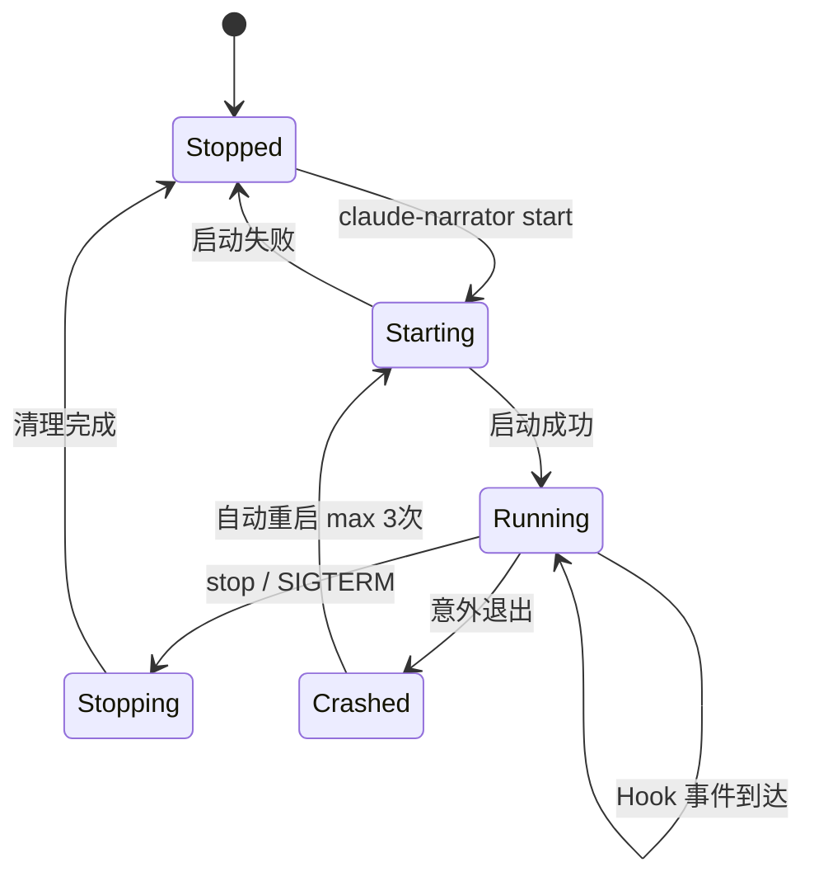
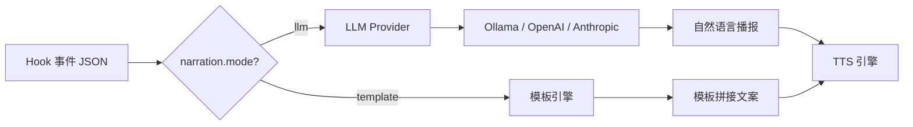

# Claude Narrator — 设计规格文档

## Context

Claude Code 在执行任务时，用户如果不盯着终端就无法了解进度。这在长时间任务、多窗口并行、或离开座位时尤为痛苦。claude-narrator 通过 TTS 语音实时播报 Claude Code 的工作状态来解决这一问题，填补了 Claude Code 生态中语音播报的空白。

本文档是基于 [PRD](../claude-narrator-PRD.md) 的详细技术设计，覆盖全部三个开发阶段（MVP → 完善 → 增强）。

---

## 1. 架构概览

### 1.1 技术栈决策

| 决策项 | 选择 | 理由 |
|--------|------|------|
| 语言 | Python | edge-tts 原生支持、asyncio 天然适合队列、Hooks 生态主流 |
| 配置格式 | JSON | 与 Claude Code 生态一致（settings.json）、零额外依赖 |
| 播报模板格式 | JSON | 与配置统一，减少依赖 |
| IPC 机制 | Unix Socket + HTTP 回退 | Socket 高性能（macOS/Linux）；HTTP 兼容 Windows |
| 音频播放 | pygame.mixer | 内置播放、可控中断、跨平台 |
| 发布形态 | 双形态 | pip/pipx 安装 + Claude Code Plugin (.claude-plugin) |

### 1.2 数据流



**关键原则：**
- Hook 脚本是无状态的一次性进程，唯一职责是转发事件到 daemon
- 所有复杂逻辑（过滤、合并、文案生成、TTS、播放）集中在 Daemon
- Daemon 全异步（asyncio），空闲时近零 CPU
- IPC 层抽象：根据平台自动选择 `UnixSocketTransport` / `HttpTransport`

---

## 2. Hook 事件系统

### 2.1 监听事件

| Hook 事件 | 触发时机 | 播报内容示例 |
|-----------|---------|-------------|
| `PreToolUse` | 工具调用前 | "Reading src/app.py" |
| `PostToolUse` | 工具调用后 | "Finished editing app.py" |
| `PostToolUseFailure` | 工具调用失败 | "Command failed" |
| `Stop` | Agent 完成响应 | "Task complete" |
| `Notification` | 需要用户注意 | "Permission needed" |
| `SubagentStart` | 子 Agent 启动 | "Starting subtask: explore" |
| `SubagentStop` | 子 Agent 完成 | "Subtask complete" |
| `SessionStart` | 会话开始 | "Session started" |
| `PreCompact` | 上下文压缩前 | "Compacting context" |

### 2.2 Hook 脚本设计

统一入口 `claude_narrator.hooks.on_event`：

```python
# 简化伪代码
import sys, json, socket

def main():
    event = json.load(sys.stdin)
    event["hook_event_name"] = os.environ.get("CLAUDE_HOOK_EVENT_NAME", "")

    # 发送到 daemon（fire-and-forget）
    try:
        send_to_daemon(event)  # Unix Socket 或 HTTP
    except ConnectionRefusedError:
        pass  # daemon 未运行，静默忽略

    # 立即退出，不输出任何内容（不影响 Claude Code 行为）
    sys.exit(0)
```

**设计要点：**
- 不解析事件、不过滤、不生成文案——全部交给 daemon
- 连接失败静默忽略，不影响 Claude Code
- 超时设为 5 秒（hook 配置），但实际执行 < 200ms
- 通过 `python -m claude_narrator.hooks.on_event` 调用，确保跨平台兼容
- **Python 路径**：`install` 命令自动探测 claude_narrator 所在的 Python 解释器完整路径（如 `/usr/local/bin/python3` 或 pipx 虚拟环境中的路径），写入 hooks 配置。避免系统 python 与安装环境不一致的问题

### 2.3 Hooks 注入配置

安装时注入到 `~/.claude/settings.json`：

```json
{
  "hooks": {
    "PreToolUse": [{"matcher": "*", "hooks": [{"type": "command", "command": "python -m claude_narrator.hooks.on_event", "timeout": 5}]}],
    "PostToolUse": [{"matcher": "*", "hooks": [{"type": "command", "command": "python -m claude_narrator.hooks.on_event", "timeout": 5}]}],
    "PostToolUseFailure": [{"matcher": "*", "hooks": [{"type": "command", "command": "python -m claude_narrator.hooks.on_event", "timeout": 5}]}],
    "Stop": [{"matcher": "*", "hooks": [{"type": "command", "command": "python -m claude_narrator.hooks.on_event", "timeout": 5}]}],
    "Notification": [{"matcher": "*", "hooks": [{"type": "command", "command": "python -m claude_narrator.hooks.on_event", "timeout": 5}]}],
    "SubagentStart": [{"matcher": "*", "hooks": [{"type": "command", "command": "python -m claude_narrator.hooks.on_event", "timeout": 5}]}],
    "SubagentStop": [{"matcher": "*", "hooks": [{"type": "command", "command": "python -m claude_narrator.hooks.on_event", "timeout": 5}]}],
    "SessionStart": [{"matcher": "*", "hooks": [{"type": "command", "command": "python -m claude_narrator.hooks.on_event", "timeout": 5}]}],
    "PreCompact": [{"matcher": "*", "hooks": [{"type": "command", "command": "python -m claude_narrator.hooks.on_event", "timeout": 5}]}]
  }
}
```

---

## 3. 智能队列与性能策略

### 3.1 事件处理管线



### 3.2 Verbosity 过滤

在事件进入队列之前过滤，减少后续处理压力：

| 等级 | 通过的事件 | 预估通过率 |
|------|-----------|-----------|
| `minimal` | Stop, Notification, PostToolUseFailure | ~5% |
| `normal`（默认） | 以上 + 文件操作的 Pre/PostToolUse, SubagentStart/Stop | ~30% |
| `verbose` | 全部事件 | 100% |

### 3.3 事件合并器（Event Coalescer）

解决突发连续事件的核心机制：

- **时间窗口合并**：相同工具类型在 2 秒内的连续调用合并为一条
  - 例：5 次 `Read` → "读取了 5 个文件"
  - 例：3 次 `Edit` → "编辑了 3 个文件"
- **取消覆盖**：同一文件的 `PreToolUse` 被后续 `PostToolUse` 覆盖
- **配置项**：`skip_rapid_events: true`（默认开启）

### 3.4 优先级队列

三级优先级系统：

| 优先级 | 事件类型 | 行为 |
|--------|---------|------|
| **高** | Notification, PostToolUseFailure | **打断当前播放**，立即播报 |
| **中** | Stop, SubagentStart/Stop, SessionStart | 正常排队 |
| **低** | PreToolUse, PostToolUse, PreCompact | 队列满时丢弃最旧的低优先级 |

队列管理规则：
- `max_queue_size = 5`（可配置）
- 队列满时：丢弃低优先级 → 合并中优先级 → 永不丢弃高优先级

### 3.5 播放控制

- **可中断播放**：高优先级事件到达时，停止当前音频，立即播放新事件
- **自然完成**：默认每条播报播放到结束，不设硬超时
- **文案长度控制**：模板文案控制在 ~20 词以内（约 3-5 秒语音）
- **兜底保护**：`max_narration_seconds = 15`（可配置），仅防止 TTS 引擎卡死
- **音频缓存**：常见固定文案预生成音频，缓存到 `~/.claude-narrator/cache/`

### 3.6 性能预估

| 场景 | 事件频率 | normal 模式下播报频率 | 体验 |
|------|---------|---------------------|------|
| 普通编码 | ~1 事件/5s | ~1 播报/5s | 流畅 |
| 密集文件操作 | ~10 事件/2s | 合并为 ~1 播报/2s | 流畅 |
| 极端突发 | ~50 事件/5s | 合并+丢弃 → ~3 播报/5s | 可接受 |

| Daemon 状态 | CPU | 内存 |
|-------------|-----|------|
| 空闲 | ~0% | ~25MB |
| 单次播报 | ~2-5% | ~30MB |
| 密集播报 | ~5-10% | ~35MB |

---

## 4. TTS 引擎抽象层

### 4.1 接口设计

```python
class TTSEngine(ABC):
    """TTS 引擎抽象基类"""
    async def synthesize(self, text: str, voice: str, language: str) -> bytes
    """合成音频，返回音频字节数据"""

    async def stream(self, text: str, ...) -> AsyncIterator[bytes]
    """流式合成（可选实现）"""

    def supported_voices(self) -> list[dict]
    """返回支持的音色列表"""

    def supports_streaming(self) -> bool
    """是否支持流式合成"""
```

### 4.2 引擎实现

| 引擎 | 类名 | 合成方式 | 平台 | 延迟 | 依赖 |
|------|------|---------|------|------|------|
| edge-tts | `EdgeTTSEngine` | 异步 HTTP → MP3 | 全平台 | ~500ms-1s | `edge-tts` |
| macOS say | `MacOSSayEngine` | `say -o` → AIFF | macOS | ~200ms | 系统自带 |
| espeak | `EspeakEngine` | `espeak-ng --stdout` → WAV | Linux | ~100ms | 系统安装 |
| OpenAI TTS | `OpenAITTSEngine` | REST API → MP3 | 全平台 | ~1-2s | `httpx`, API key |

### 4.3 音频播放

```python
class AudioPlayer:
    """音频播放器，使用 pygame.mixer"""
    async def play(self, audio_data: bytes, format: str) -> None
    async def stop(self) -> None       # 中断当前播放
    def is_playing(self) -> bool
```

### 4.4 音频缓存

- 缓存位置：`~/.claude-narrator/cache/`
- 缓存 key：`{engine}_{voice}_{language}_{sha256(text)[:16]}.mp3`
- LRU 淘汰策略，最大 50MB（可配置）
- 常见固定文案（"Task complete" 等）可预热缓存

---

## 5. Daemon 进程管理

### 5.1 生命周期



### 5.2 PID 管理

- PID 文件：`~/.claude-narrator/daemon.pid`
- 启动检查：PID 存在且进程存活 → 报告已运行
- 启动检查：PID 存在但进程不存在 → 清理陈旧 PID，正常启动
- 停止：SIGTERM → 等待 graceful shutdown（5s）→ SIGKILL

### 5.3 IPC 服务层

```python
class IPCServer(ABC):
    async def start(self) -> None
    async def stop(self) -> None
    async def events(self) -> AsyncIterator[dict]

class UnixSocketServer(IPCServer):
    # 监听 ~/.claude-narrator/narrator.sock
    # macOS/Linux 默认

class HTTPServer(IPCServer):
    # 监听 127.0.0.1:19821
    # Windows 默认 / macOS&Linux 回退
```

平台自动选择：
- macOS/Linux：优先 Unix Socket，Socket 创建失败时回退 HTTP
- Windows：直接使用 HTTP

---

## 6. 播报文案系统

### 6.1 模板模式（默认）

模板文件位于 `i18n/` 目录，JSON 格式：

```json
{
  "PreToolUse": {
    "Read": "Reading {file_path}",
    "Write": "Writing to {file_path}",
    "Edit": "Editing {file_path}",
    "Bash": "Running: {command_short}",
    "Glob": "Searching files: {pattern}",
    "Grep": "Searching for: {query}",
    "default": "Using tool: {tool_name}"
  },
  "PostToolUse": {
    "Read": "Finished reading {file_path}",
    "Write": "Finished writing {file_path}",
    "Edit": "Finished editing {file_path}",
    "Bash": "Command complete",
    "default": "{tool_name} done"
  }
}
```

支持语言：`en`（默认）、`zh`、`ja`。

### 6.2 LLM 模式（Phase 3）



- Provider 抽象层统一接口，支持 Ollama（本地）、OpenAI、Anthropic
- Prompt 传入事件 JSON + 最近 3 条事件上下文
- 超过 3 秒未响应则回退到模板模式
- 推荐模型：Ollama 本地 3B / GPT-4o-mini / Haiku

---

## 7. 配置系统

### 7.1 配置文件位置

`~/.claude-narrator/config.json`

### 7.2 完整配置结构

```json
{
  "general": {
    "verbosity": "normal",
    "language": "en",
    "enabled": true
  },
  "tts": {
    "engine": "edge-tts",
    "voice": "en-US-AriaNeural",
    "openai": {
      "api_key_env": "OPENAI_API_KEY",
      "model": "tts-1",
      "voice": "nova"
    }
  },
  "narration": {
    "mode": "template",
    "max_queue_size": 5,
    "max_narration_seconds": 15,
    "skip_rapid_events": true,
    "llm": {
      "provider": "ollama",
      "model": "qwen2.5:3b"
    }
  },
  "cache": {
    "enabled": true,
    "max_size_mb": 50,
    "directory": "~/.claude-narrator/cache"
  },
  "filters": {
    "ignore_tools": [],
    "ignore_paths": [],
    "only_tools": null,
    "custom_rules": [
      {
        "match": {"tool": "Bash", "input_contains": "npm test"},
        "action": "force_verbosity",
        "value": "minimal"
      }
    ]
  }
}
```

### 7.3 配置加载策略

1. 加载内置默认配置
2. 读取 `~/.claude-narrator/config.json`
3. 深度合并（用户配置覆盖默认值）
4. 验证所有值（无效值静默回退到默认）

---

## 8. CLI 命令

使用 `click` 或 `typer` 框架：

| 命令 | 功能 |
|------|------|
| `claude-narrator start` | 启动 daemon（可 `--foreground` 前台运行） |
| `claude-narrator stop` | 停止 daemon |
| `claude-narrator restart` | 重启 daemon |
| `claude-narrator status` | 显示状态（运行状态、引擎、队列长度） |
| `claude-narrator test "text"` | 测试播放指定文本 |
| `claude-narrator install` | 注入 hooks 到 settings.json |
| `claude-narrator uninstall` | 移除 hooks 配置 |
| `claude-narrator config get <key>` | 读取配置项 |
| `claude-narrator config set <key> <val>` | 设置配置项 |
| `claude-narrator config reset` | 恢复默认配置 |
| `claude-narrator cache clear` | 清除音频缓存 |

---

## 9. Plugin 形态

### 9.1 目录结构

```
.claude-plugin/
├── plugin.json
└── marketplace.json

commands/
├── setup.md          # /narrator:setup
├── configure.md      # /narrator:configure
└── status.md         # /narrator:status
```

### 9.2 plugin.json

```json
{
  "name": "claude-narrator",
  "description": "TTS audio narration for Claude Code - hear what Claude is doing",
  "version": "0.1.0",
  "commands": [
    { "name": "setup", "description": "Interactive setup wizard", "entrypoint": "./commands/setup.md" },
    { "name": "configure", "description": "Configure narrator settings", "entrypoint": "./commands/configure.md" },
    { "name": "status", "description": "Check narrator status", "entrypoint": "./commands/status.md" }
  ],
  "author": "hoshizora",
  "license": "MIT"
}
```

Plugin 命令（Markdown）内部调用 Python CLI，提供交互式体验。

---

## 10. 项目结构

```
claude-narrator/
├── .claude-plugin/
│   ├── plugin.json
│   └── marketplace.json
├── commands/
│   ├── setup.md
│   ├── configure.md
│   └── status.md
├── src/
│   └── claude_narrator/
│       ├── __init__.py
│       ├── cli.py                # CLI 入口 (click/typer)
│       ├── daemon.py             # Daemon 主循环 (asyncio)
│       ├── config.py             # 配置加载与验证
│       ├── installer.py          # 安装器 (注入 hooks)
│       ├── hooks/
│       │   ├── __init__.py
│       │   └── on_event.py       # 统一 Hook 入口
│       ├── narration/
│       │   ├── __init__.py
│       │   ├── template.py       # 模板模式
│       │   ├── llm.py            # LLM 模式 (Phase 3)
│       │   └── coalescer.py      # 事件合并器
│       ├── tts/
│       │   ├── __init__.py
│       │   ├── base.py           # 抽象基类
│       │   ├── edge.py           # edge-tts
│       │   ├── macos_say.py      # macOS say
│       │   ├── espeak.py         # espeak/piper
│       │   └── openai_tts.py     # OpenAI TTS
│       ├── ipc/
│       │   ├── __init__.py
│       │   ├── base.py           # IPC 抽象
│       │   ├── unix_socket.py    # Unix Socket 实现
│       │   └── http.py           # HTTP 实现
│       ├── player.py             # 音频播放 (pygame)
│       ├── queue.py              # 优先级队列
│       ├── cache.py              # 音频缓存
│       └── i18n/
│           ├── en.json
│           ├── zh.json
│           └── ja.json
├── tests/
│   ├── test_config.py
│   ├── test_narration.py
│   ├── test_coalescer.py
│   ├── test_tts_engines.py
│   ├── test_queue.py
│   ├── test_hooks.py
│   ├── test_ipc.py
│   └── test_cache.py
├── pyproject.toml
├── README.md
├── README.zh.md
├── LICENSE
└── .gitignore
```

---

## 11. 开发阶段

### Phase 1: MVP（1-2 天）

- 项目脚手架（pyproject.toml, 目录结构）
- 配置系统（config.py, 默认配置）
- Hook 脚本（on_event.py）
- IPC 层（Unix Socket + HTTP）
- Daemon 核心（asyncio 主循环, PID 管理）
- TTS 引擎：edge-tts
- 音频播放：pygame
- 模板模式播报（英文）
- 基础队列（FIFO, max_size）
- CLI：start, stop, test, install
- README（英文）

### Phase 2: 完善（1 周）

- 全部 TTS 引擎（say, espeak, openai）
- Verbosity 三级过滤
- 事件合并器（Coalescer）
- 优先级队列 + 可中断播放
- 多语言模板（zh, ja）
- 音频缓存
- 完整 CLI（config, status, uninstall, cache）
- Plugin 形态（.claude-plugin, commands/*.md）
- 单元测试
- PyPI 发布
- 中文 README

### Phase 3: 增强（可选）

- LLM 模式播报
- 音效模式（事件类型 → 音效）
- 自定义事件过滤规则
- Web UI 控制面板（事件流可视化、设置调整）

---

## 12. 验证计划

### 功能验证

1. `pip install -e .` → `claude-narrator install` → 确认 hooks 已注入 settings.json
2. `claude-narrator start` → 确认 daemon 运行（PID 文件、socket/端口存在）
3. `claude-narrator test "Hello world"` → 确认 TTS 播放正常
4. 在 Claude Code 中执行操作 → 确认语音播报触发
5. 快速连续操作（读多个文件）→ 确认事件合并生效
6. `claude-narrator stop` → 确认 daemon 停止、资源释放

### 性能验证

1. 测量 hook 脚本执行时间（目标 < 200ms）
2. 测量 daemon 空闲内存（目标 < 30MB）
3. 模拟密集事件（50 事件/5s）→ 确认队列不阻塞、播报不重叠
4. 长时间运行稳定性（1 小时无内存泄漏）

### 跨平台验证

1. macOS：Unix Socket + edge-tts + pygame
2. Linux：Unix Socket + edge-tts + pygame
3. Windows：HTTP + edge-tts + pygame
