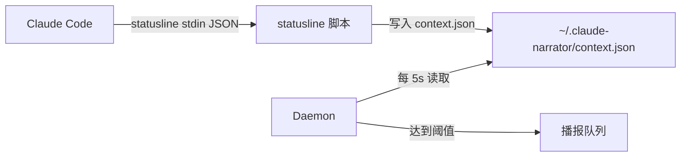

# Personality 风格系统 & Token 监控 — 设计规格文档

## Context

claude-narrator 的播报模板目前语言单调（"Reading app.py"、"Task complete"）。用户希望增加播报风格多样性，同时保留简洁选项。参考 Claude Code 内部代号 Tengu 的 90 个 spinner 词（Percolating、Cogitating 等）作为趣味风格之一。

此外，用户希望在 Token 使用量达到特定阈值时收到语音提醒。

## 1. Personality 风格系统

### 1.1 核心概念

每条播报由三个**插槽**组成：

| 插槽 | 作用 | 示例 |
|------|------|------|
| `prefix` | 前缀修饰词 | "Cogitating..." |
| `body` | 主体播报内容 | "diving into app.py" |
| `suffix` | 后缀补充信息 | （保留扩展） |

每个 personality 声明自己贡献哪些插槽。多选时各层按规则组合。

### 1.2 内置 Personality

| 名称 | prefix | body 风格 | suffix |
|------|--------|----------|--------|
| `concise`（默认） | 无 | 简短直接："Reading app.py" | 无 |
| `tengu` | 90 个 Tengu spinner 词 | 趣味动词："diving into app.py" | 无 |
| `professional` | 无 | 正式详细："Now reading source file app.py" | 无 |
| `casual` | 无 | 口语化："Checking out app.py" | 无 |

### 1.3 配置

```json
{
  "narration": {
    "personality": "concise",
    "tengu_prefix_auto_update": false
  }
}
```

`personality` 接受 `string` 或 `string[]`：
- `"concise"` → 单选
- `["tengu", "professional"]` → 层叠组合

`tengu_prefix_auto_update`：是否在 daemon 启动时从 GitHub 拉取最新 Tengu 词表（默认 `false`）。

### 1.4 模板文件格式

每个 personality 每种语言一个 JSON 文件，命名 `{lang}.{personality}.json`：

```json
{
    "_meta": {
        "name": "tengu",
        "description": "Whimsical Anthropic-style narration with spinner words"
    },
    "_prefixes": ["Cogitating", "Percolating", "Wizarding"],
    "_suffixes": [],
    "PreToolUse": {
        "Read": "diving into {file_path}",
        "Write": "conjuring up {file_path}",
        "Edit": "tinkering with {file_path}",
        "Bash": "unleashing a command",
        "Glob": "spelunking for files",
        "Grep": "hunting through the code",
        "Agent": "summoning a helper",
        "default": "wielding {tool_name}"
    },
    "PostToolUse": {
        "Read": "absorbed {file_path}",
        "Write": "manifested {file_path}",
        "Edit": "reshaped {file_path}",
        "Bash": "command vanquished",
        "default": "{tool_name} conquered"
    },
    "PostToolUseFailure": {
        "Bash": "command went sideways",
        "default": "{tool_name} fumbled"
    },
    "Stop": { "default": "mission accomplished" },
    "Notification": { "default": "hey, need your attention" },
    "SubagentStart": { "default": "dispatching a minion" },
    "SubagentStop": { "default": "minion reported back" },
    "SessionStart": { "default": "let's roll" },
    "PreCompact": { "default": "tidying up the memory banks" }
}
```

- `_meta`：元数据（名称、描述）
- `_prefixes`：prefix 插槽词池，每次随机选一个
- `_suffixes`：suffix 插槽词池，每次随机选一个
- 其余 key：body 插槽模板（与现有 i18n 结构完全兼容）

`concise` personality 不需要单独文件——当 personality 为 concise 时，直接加载现有 `{lang}.json`。

### 1.5 层叠组合规则

当 `personality` 为数组时，各层按以下规则组合：

**Prefix 插槽**：合并所有层的 `_prefixes` 词池，随机选一个（或为空）。

**Body 插槽**：
- 普通事件（PreToolUse、PostToolUse 等）：按数组顺序遍历各层，第一个有匹配模板的层胜出。
- 高优先级事件（PostToolUseFailure、Notification）：选所有层中最详细的 body 模板。判断标准：模板字符串长度最长的为"最详细"。

**Suffix 插槽**：合并所有层的 `_suffixes` 词池，随机选一个（或为空）。

**最终拼接**：`"{prefix}... {body} {suffix}"` — 空插槽自动省略。

### 1.6 Tengu 词池管理

**来源**：https://github.com/levindixon/tengu_spinner_words
**原始数据**：`https://raw.githubusercontent.com/levindixon/tengu_spinner_words/main/known-processing-words.json`

**策略**：
1. 内置快照 `i18n/tengu_words.json`（90 词，离线可用）
2. `tengu_prefix_auto_update: true` 时，daemon 启动时异步拉取 GitHub raw URL，成功则缓存到 `~/.claude-narrator/tengu_words.json`
3. 加载优先级：缓存 > 内置快照
4. 拉取失败静默忽略，不影响启动

### 1.7 TemplateNarrator 改动

```python
class TemplateNarrator:
    def __init__(self, language="en", personality="concise"):
        personalities = [personality] if isinstance(personality, str) else personality
        self._layers = []
        for p in personalities:
            data = self._load_personality(language, p)
            prefixes = data.pop("_prefixes", [])
            suffixes = data.pop("_suffixes", [])
            data.pop("_meta", None)
            self._layers.append(PersonalityLayer(prefixes, suffixes, data))
        self._fallback = self._load_templates(language)  # 现有 {lang}.json

    def narrate(self, event) -> str | None:
        body = self._resolve_body(event)
        if body is None:
            return None
        prefix = self._pick_random(self._all_prefixes())
        suffix = self._pick_random(self._all_suffixes())
        parts = [p for p in [prefix, body, suffix] if p]
        return "... ".join(parts[:1] + [parts[-1]]) if len(parts) > 1 else parts[0]
        # "Cogitating... diving into app.py"
```

---

## 2. Token 使用量监控

### 2.1 方案 A：PreCompact Hook（增强播报）

已有 PreCompact 事件支持。各 personality 模板自然覆盖：

| personality | PreCompact 播报 |
|-------------|----------------|
| concise | "Compacting context" |
| tengu | "Smooshing... tidying up the memory banks" |
| professional | "Context window nearing capacity, initiating compaction" |
| casual | "Running out of brain space, cleaning up" |

无需额外代码，personality 模板自动覆盖。

### 2.2 方案 B：Statusline 桥接（可选，默认关闭）



**组件：`context_monitor.py`**

包含两部分：
1. **Statusline 脚本**：被 Claude Code 每 ~300ms 调用，读 stdin JSON，提取 `context_window.used_percentage`，写入 `~/.claude-narrator/context.json`
2. **Monitor 协程**：在 daemon 内运行，每 5 秒读取 `context.json`，检查是否跨过阈值，跨过则向播报队列推一条消息

**配置**：
```json
{
  "context_monitor": {
    "enabled": false,
    "thresholds": [50, 70, 85, 95]
  }
}
```

**阈值去重**：维护 `_announced_thresholds: set[int]`，同一阈值只播报一次。新 session 或 token 用量回落时重置。

**播报文案**（通过 personality 模板，新增 `ContextThreshold` 事件类型）：

| personality | 70% 阈值播报 |
|-------------|-------------|
| concise | "Context 70 percent used" |
| tengu | "Ruminating... context is 70 percent full" |
| professional | "Context window utilization has reached 70 percent" |
| casual | "Heads up, context is 70 percent full" |

**Statusline 冲突警告**：启用后占用 Claude Code 的唯一 statusline 插槽。如已安装 claude-hud 等 statusline 插件，两者不兼容。`install` 和 `setup` 命令中明确提醒用户。

### 2.3 Statusline 注册

启用 context monitor 时，`installer.py` 额外在 `~/.claude/settings.json` 中写入：

```json
{
  "statusLine": {
    "type": "command",
    "command": "{python_path} -m claude_narrator.context_monitor"
  }
}
```

`uninstall` 时同时移除此配置。

---

## 3. 文件结构

### 新建文件

```
src/claude_narrator/i18n/
├── tengu_words.json        # Tengu 词池快照（90 词 JSON 数组）
├── en.tengu.json           # 英文 Tengu 风格模板
├── en.professional.json    # 英文正式风格模板
├── en.casual.json          # 英文轻松风格模板
├── zh.tengu.json           # 中文 Tengu 风格模板
├── zh.professional.json    # 中文正式风格模板
├── zh.casual.json          # 中文轻松风格模板
├── ja.tengu.json           # 日文 Tengu 风格模板
├── ja.professional.json    # 日文正式风格模板
└── ja.casual.json          # 日文轻松风格模板

src/claude_narrator/
└── context_monitor.py      # Statusline 桥接 + 阈值检查

tests/
├── test_personality.py     # Personality 层叠组合测试
└── test_context_monitor.py # Context monitor 测试
```

### 修改文件

| 文件 | 改动 |
|------|------|
| `narration/template.py` | 重写：支持 personality 加载、三插槽层叠、Tengu 词池 |
| `config.py` | 加 `personality`、`tengu_prefix_auto_update`、`context_monitor` |
| `daemon.py` | 传 personality；可选启动 context monitor 协程 |
| `narration/llm.py` | LLMNarrator 接受 personality 传给 fallback |
| `installer.py` | context_monitor 启用时注册/移除 statusline |
| `cli.py` | 增加 personality 和 context monitor 相关配置 |
| `commands/setup.md` | 增加 personality 选择步骤 |
| `commands/configure.md` | 增加 personality 和 context monitor 配置 |
| 所有 README | 文档更新 |
| `CHANGELOG.md` | 记录新功能 |

---

## 4. 配置总览（新增字段）

```json
{
  "narration": {
    "personality": "concise",
    "tengu_prefix_auto_update": false
  },
  "context_monitor": {
    "enabled": false,
    "thresholds": [50, 70, 85, 95]
  }
}
```

### 向后兼容

- `personality` 默认 `"concise"`，行为与当前完全一致
- 现有 `en.json`/`zh.json`/`ja.json` 保留不变，作为 concise fallback
- `context_monitor` 默认 `false`，不影响现有用户
- `tengu_prefix_auto_update` 默认 `false`，不发网络请求

---

## 5. 验证计划

### 功能验证

1. `personality: "concise"` → 播报与当前一致
2. `personality: "tengu"` → 播报带 spinner 前缀 + 趣味模板
3. `personality: ["tengu", "professional"]` → spinner 前缀 + professional body
4. `personality: "casual"` → 轻松口语风格
5. 各语言（en/zh/ja）× 各 personality 组合均能正常加载
6. `tengu_prefix_auto_update: true` → daemon 启动时拉取 GitHub 词表并缓存
7. `context_monitor: { enabled: true }` → statusline 注册，阈值播报触发
8. `context_monitor` 与现有 hooks 不冲突

### 测试

- `test_personality.py`：层叠组合、插槽解析、fallback 逻辑、Tengu 词池加载
- `test_context_monitor.py`：阈值检测、去重、context.json 读写
- 现有 128 个测试不回归
