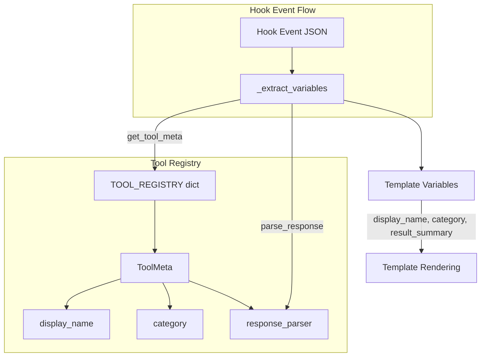
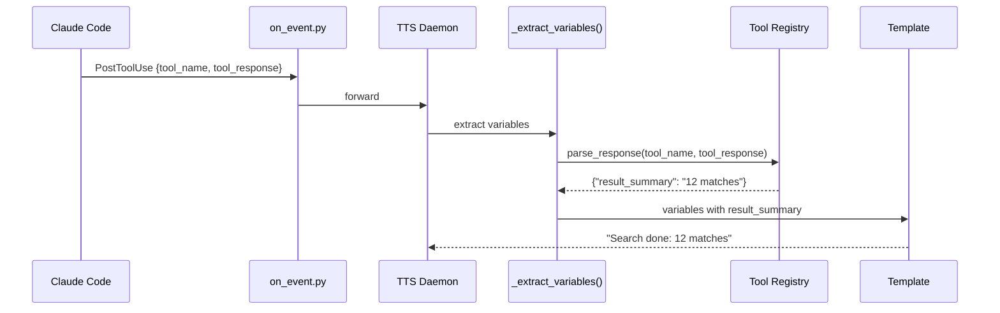

# 智能叙述增强设计

## Context

通过分析 `claude-code-sourcemap`（Claude Code v2.1.88 源码），发现 claude-narrator 当前只利用了 hook 事件的基本字段，而 Claude Code 实际提供了远比我们使用的更丰富的数据。本设计旨在利用这些信息，使叙述从"泛化播报"升级为"智能语境感知播报"。

**当前问题示例：**
- 40+ 工具只认识 7 个，其余全说 "Using {tool_name}"
- 所有 Notification 都只说 "需要注意"，不区分等待输入、权限确认、认证成功
- PostToolUse 只说 "完成"，不提供任何操作结果信息

**目标：** 让用户不看终端就能准确知道发生了什么。

---

## Feature 1: Tool Registry（工具元数据注册表）

### 架构

新增 `src/claude_narrator/tool_registry.py`，作为工具叙述元数据的单一来源。



### 数据模型

```python
class ToolCategory(str, Enum):
    FILE = "file"          # Read, Write, Edit, Glob, Grep
    COMMAND = "command"    # Bash, PowerShell, REPL
    AGENT = "agent"        # Agent, SendMessage, Brief
    SEARCH = "search"      # WebSearch, WebFetch, ToolSearch
    PLAN = "plan"          # EnterPlanMode, ExitPlanMode
    TASK = "task"          # TaskCreate, TaskGet, TaskUpdate, TaskList, TaskStop, TaskOutput
    MCP = "mcp"            # MCPTool, ListMcpResources, ReadMcpResource, McpAuth, Skill
    WORKTREE = "worktree"  # EnterWorktree, ExitWorktree
    NOTEBOOK = "notebook"  # NotebookEdit
    OTHER = "other"        # 未注册工具兜底

@dataclass(frozen=True)
class ToolMeta:
    name: str              # Claude Code 内部工具名（如 "Bash"）
    display_name: str      # 人类可读名（如 "shell command"）
    category: ToolCategory
    response_parser: Callable[[Any], dict[str, str]] | None = None
```

### 注册表内容（40+ 工具）

| 工具名 | display_name | category | response_parser |
|--------|-------------|----------|-----------------|
| Read | file read | FILE | `_parse_read_response` |
| Write | file write | FILE | None |
| Edit | file edit | FILE | None |
| Glob | file search | FILE | `_parse_glob_response` |
| Grep | code search | SEARCH | `_parse_grep_response` |
| Bash | shell command | COMMAND | `_parse_bash_response` |
| PowerShell | PowerShell command | COMMAND | `_parse_bash_response` |
| REPL | REPL session | COMMAND | None |
| Agent | subagent | AGENT | None |
| SendMessage | message | AGENT | None |
| Brief | brief output | AGENT | None |
| WebSearch | web search | SEARCH | `_parse_web_search_response` |
| WebFetch | web fetch | SEARCH | None |
| ToolSearch | tool search | SEARCH | None |
| EnterPlanMode | plan mode | PLAN | None |
| ExitPlanMode | plan exit | PLAN | None |
| TaskCreate | task creation | TASK | None |
| TaskUpdate | task update | TASK | None |
| TaskGet | task query | TASK | None |
| TaskList | task list | TASK | None |
| TaskStop | task stop | TASK | None |
| TaskOutput | task output | TASK | None |
| MCPTool | MCP tool | MCP | None |
| ListMcpResources | MCP resource list | MCP | None |
| ReadMcpResource | MCP resource read | MCP | None |
| McpAuth | MCP authentication | MCP | None |
| Skill | skill invocation | MCP | None |
| EnterWorktree | worktree entry | WORKTREE | None |
| ExitWorktree | worktree exit | WORKTREE | None |
| NotebookEdit | notebook edit | NOTEBOOK | None |
| AskUserQuestion | user question | OTHER | None |
| Config | configuration | OTHER | None |
| RemoteTrigger | remote trigger | OTHER | None |
| ScheduleCron | scheduled task | OTHER | None |
| Sleep | pause | OTHER | None |
| TeamCreate | team creation | TASK | None |
| TeamDelete | team deletion | TASK | None |
| LSP | language server | OTHER | None |
| TodoWrite | todo update | OTHER | None |

### 公开接口

```python
def get_tool_meta(tool_name: str) -> ToolMeta:
    """获取工具元数据。未注册工具返回 OTHER 分类的兜底 ToolMeta。"""

def get_display_name(tool_name: str) -> str:
    """快捷获取显示名。未注册工具返回原始 tool_name。"""

def parse_response(tool_name: str, response: Any) -> dict[str, str]:
    """调用工具的 response_parser 解析结果。无解析器或解析失败返回空 dict。"""
```

### Response Parsers

只为关键工具实现解析器，解析 `tool_response` 提取结构化摘要：

```python
def _parse_bash_response(resp: Any) -> dict[str, str]:
    # str → 统计输出行数
    # dict with exit_code/exitCode → 提取 exit code
    # 返回 {"result_summary": "exit code 0"} 或 {"result_summary": "15 lines of output"}

def _parse_grep_response(resp: Any) -> dict[str, str]:
    # str → 按行数统计匹配数
    # 返回 {"result_summary": "12 matches"}

def _parse_glob_response(resp: Any) -> dict[str, str]:
    # str → 按行数统计文件数
    # 返回 {"result_summary": "8 files found"}

def _parse_read_response(resp: Any) -> dict[str, str]:
    # str → 统计行数
    # 返回 {"result_summary": "247 lines"}

def _parse_web_search_response(resp: Any) -> dict[str, str]:
    # str → 统计结果数
    # 返回 {"result_summary": "5 results"}
```

所有 parser 都是 **尽力而为**：解析失败返回空 dict，模板使用 KeyError 安全网兜底。

---

## Feature 2: Notification 类型解析

### 来源

从 Claude Code 源码发现 Notification hook 的 `notification_type` 字段有以下已知值：

| notification_type | 含义 |
|-------------------|------|
| `idle_prompt` | Claude 等待用户输入 |
| `worker_permission_prompt` | 工作者需要权限确认 |
| `computer_use_enter` | 进入计算机使用模式 |
| `computer_use_exit` | 退出计算机使用模式 |
| `auth_success` | 认证成功 |
| `elicitation_complete` | MCP 交互完成 |
| `elicitation_response` | MCP 响应已发送 |

### 实现

1. `_get_sub_key()` 为 `Notification` 事件返回 `event.get("notification_type", "default")`
2. i18n 模板为 Notification 添加按 notification_type 区分的子键
3. 未知 notification_type 落入 `"default"` 兜底

### i18n 模板示例（en.json）

```json
"Notification": {
    "idle_prompt": "Waiting for your input",
    "worker_permission_prompt": "A worker needs your permission",
    "computer_use_enter": "Entering computer use mode",
    "computer_use_exit": "Exiting computer use mode",
    "auth_success": "Authentication successful",
    "elicitation_complete": "Server interaction completed",
    "elicitation_response": "Server response sent",
    "default": "Attention needed"
}
```

---

## Feature 3: PostToolUse 结果摘要

### 数据流



### 集成点

在 `_extract_variables()` 中，当 `hook_event_name == "PostToolUse"` 且 `tool_response` 存在时：

```python
if event.get("hook_event_name") == "PostToolUse" and "tool_response" in event:
    summary_vars = parse_response(
        event.get("tool_name", ""),
        event["tool_response"],
    )
    variables.update(summary_vars)
```

### PostToolUse 模板示例

```json
"PostToolUse": {
    "Read": "Read complete: {result_summary}",
    "Bash": "Command done: {result_summary}",
    "Grep": "Search done: {result_summary}",
    "Glob": "Found {result_summary}",
    "WebSearch": "Web search done: {result_summary}",
    "default": "{display_name} completed"
}
```

当 `result_summary` 变量不存在时（parser 返回空 dict 或无 parser），模板的 KeyError 安全网会返回不含变量的原始模板字符串。

---

## 与模板系统的集成

### `_extract_variables()` 新增变量

| 变量名 | 来源 | 说明 |
|--------|------|------|
| `display_name` | `get_display_name(tool_name)` | 人类可读工具名 |
| `category` | `get_tool_meta(tool_name).category.value` | 工具分类名 |
| `result_summary` | `parse_response(tool_name, tool_response)` | PostToolUse 操作结果摘要 |
| `notification_type` | `event.get("notification_type")` | 已在之前版本提取 |

### 模板查找优先级（不变）

1. 先按 `tool_name`（或 sub_key）查找具体模板
2. 找不到则使用 `"default"` 兜底

这意味着注册表中所有 40+ 工具无需在模板中逐一添加条目。只有叙述有差异化价值的工具才需要单独的模板条目，其余使用 `"default": "{display_name} completed"` 即可。

---

## 影响范围

### 新增文件（2个）
- `src/claude_narrator/tool_registry.py`
- `tests/test_tool_registry.py`

### 修改文件（~16个）
- `src/claude_narrator/narration/template.py` — `_extract_variables()` 集成 registry；`_get_sub_key()` 添加 Notification
- `src/claude_narrator/i18n/en.json` — Notification 子键 + PostToolUse 增强模板
- `src/claude_narrator/i18n/zh.json` — 同上中文
- `src/claude_narrator/i18n/ja.json` — 同上日文
- 9 个人格 JSON — 同步新增模板
- `tests/test_template.py` — 新增测试
- `CHANGELOG.md` — 版本记录

### 不修改的文件
- `daemon.py`、`verbosity.py`、`queue.py`、`coalescer.py`、`installer.py`、`sounds.py` — 不受影响

---

## 验证方式

1. `uv run pytest` — 全部测试通过
2. 手动验证：构造各类 hook event JSON，确认叙述输出
3. 回归验证：现有 218 个测试不应受影响
